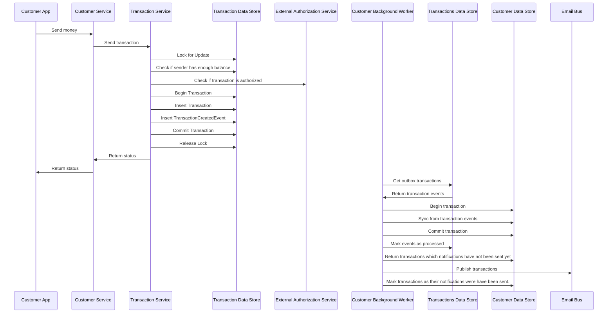

```mermaid
sequenceDiagram
Customer App->>Customer Service: Send money
Customer Service->>Transaction Service: Send transaction
Transaction Service->>Transaction Data Store: Lock for Update
Transaction Service->>Transaction Data Store: Check if sender has enough balance
Transaction Service->>External Authorization Service: Check if transaction is authorized
Transaction Service->>Transaction Data Store: Begin Transaction
Transaction Service->>Transaction Data Store: Insert Transaction
Transaction Service->>Transaction Data Store: Insert TransactionCreatedEvent
Transaction Service->>Transaction Data Store: Commit Transaction
Transaction Service->>Transaction Data Store: Release Lock
Transaction Service->>Customer Service: Return status
Customer Service->>Customer App: Return status
Customer Background Worker->>Transactions Data Store: Get outbox transactions
Transactions Data Store->>Customer Background Worker: Return transaction events
Customer Background Worker->>Customer Data Store: Begin transaction
Customer Background Worker->>Customer Data Store: Sync from transaction events
Customer Background Worker->>Customer Data Store: Commit transaction
Customer Background Worker->>Transactions Data Store: Mark events as processed
Customer Background Worker->>Customer Data Store: Return transactions which notifications have not been sent yet
Customer Background Worker->>Email Bus: Publish transactions
Customer Background Worker->>Customer Data Store: Mark transactions as their notifications were have been sent.
```
