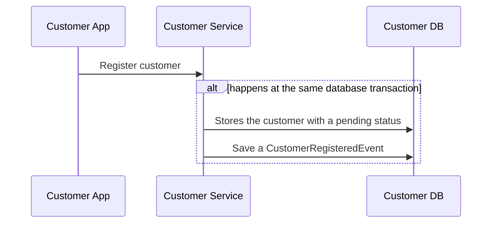
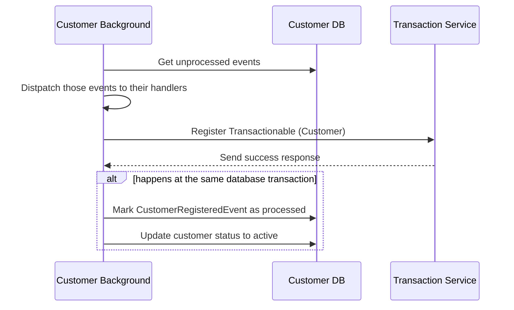

## Garantindo a consistênca em processos que não dependem apenas deles mesmos.

### **Registro de Cliente**

- Quando um cliente/usuário é registrado ao serviço de `customers`, ele também deve ser registrado ao serviço de `transactions`, o que normalmente não pode ser garantido, caso aconteçao uma eventual falha no segundo serviço. Para garantir a consistência entre esses serviços, foi aplicado o seguinte padrão:


- O serviço gera um evento durante determinado processo (o registro de um cliente nesse exêmplo) e é interrompido, guardando seu estado atual.



- Um processo rodando em background busca por eventos ainda não processados, envia para o serviço de `transactions`, garante o registro do cliente lá, e em uma mesma transação do banco de dados, marca tanto o evento como processado, quanto ativa o cliente.

- Caso aconteça uma falha no envio do registro para o serviço de `transactions` o processo vai ser interrompido. Como o evento não foi marcado como terminado, nas próximas buscas por eventos não processados o evento vai ser retornado, até que possa ser concluido.

O mesmo processo, também conhecido como [Outbox Pattern](https://learn.microsoft.com/en-us/azure/architecture/best-practices/transactional-outbox-cosmos), foi aplicado no processo de envio de transações, garantindo o envio dos emails de confirmação.

<!--
```mermaid
sequenceDiagram
Customer App->>Customer Service: Send money
Customer Service->>Transaction Service: Send transaction
Transaction Service->>Transaction Data Store: Lock for Update
Transaction Service->>Transaction Data Store: Check if sender has enough balance
Transaction Service->>External Authorization Service: Check if transaction is authorized
Transaction Service->>Transaction Data Store: Begin Transaction
Transaction Service->>Transaction Data Store: Insert Transaction
Transaction Service->>Transaction Data Store: Insert TransactionCreatedEvent
Transaction Service->>Transaction Data Store: Commit Transaction
Transaction Service->>Transaction Data Store: Release Lock
Transaction Service->>Customer Service: Return status
Customer Service->>Customer App: Return status
Customer Background Worker->>Transactions Data Store: Get outbox transactions
Transactions Data Store->>Customer Background Worker: Return transaction events
Customer Background Worker->>Customer Data Store: Begin transaction
Customer Background Worker->>Customer Data Store: Sync from transaction events
Customer Background Worker->>Customer Data Store: Commit transaction
Customer Background Worker->>Transactions Data Store: Mark events as processed
Customer Background Worker->>Customer Data Store: Return transactions which notifications have not been sent yet
Customer Background Worker->>Email Bus: Publish transactions
Customer Background Worker->>Customer Data Store: Mark transactions as their notifications were have been sent.
``` -->
