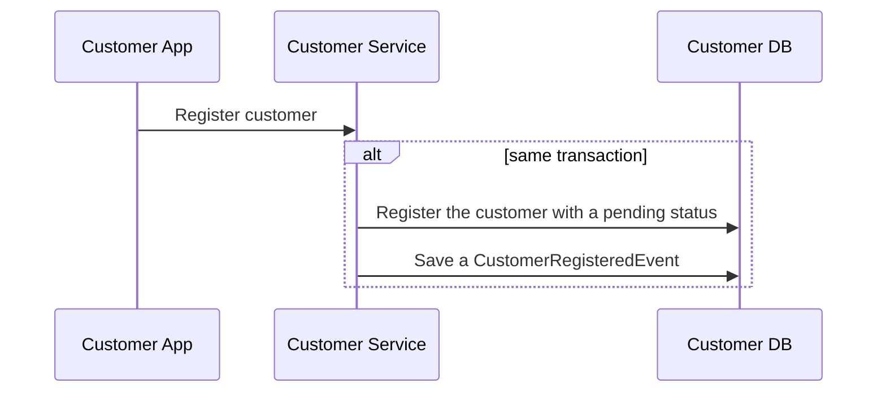
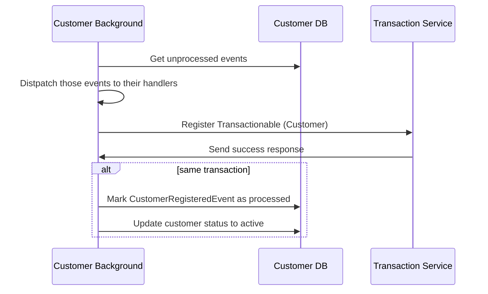

# Problemas de Consistência

## Envio do email de confirmação:

- Pior caso: Uma transação é criada, aprovada e antes do serviço de envio de emails ser chamado, o serviço cai.
- Consequência: Quando o serviço subir novamente, o processo da criação da transação já vai ter se encerrado.
Consequentemente o email de confirmação nunca vai ser enviado.
- Solução: Criar um evento de criação de transação quando uma transação é recebida e processada. Um processo rodando em
background vai buscar por eventos de transação, chamar o serviço de envio de email e marcar o evento como processado.
- Referências: https://learn.microsoft.com/en-us/azure/architecture/best-practices/transactional-outbox-cosmos

Comunicar com o serviço de aprovação de transações

- Pior caso: O serviço está offline devido a muitas requisições feitas pelo nosso serviço.
- Consequências: Continuar enviando requisições pro serviço, impedindo que ele se recupere.
- Solução: Implementar um circuit breaker aos clientes que comunicam com esse serviço externo.
- Referências: https://martinfowler.com/bliki/CircuitBreaker.html

# Linha do tempo dos principais eventos entre os sistemas

## - Registro de Cliente

- Quando um cliente/usuário é registrado ao serviço de `customers`, ele também deve ser registrado ao serviço de `transactions`. A consistência do processo é garantida por estarmos utilizando o [padrão outbox](https://learn.microsoft.com/en-us/azure/architecture/best-practices/transactional-outbox-cosmos).


- O processo gera um evento e se mantém esperando por seu processamento (um status de pendig por exêmplo). Quando o evento termina de ser processado, o status do processo é atualizado na mesma transação que marca o evento como processado.



Esse mesmo processo foi aplicado pra garantir o envio do email de confirmação pro usuário que recebeu o pagamento.

<!--
```mermaid
sequenceDiagram
Customer App->>Customer Service: Send money
Customer Service->>Transaction Service: Send transaction
Transaction Service->>Transaction Data Store: Lock for Update
Transaction Service->>Transaction Data Store: Check if sender has enough balance
Transaction Service->>External Authorization Service: Check if transaction is authorized
Transaction Service->>Transaction Data Store: Begin Transaction
Transaction Service->>Transaction Data Store: Insert Transaction
Transaction Service->>Transaction Data Store: Insert TransactionCreatedEvent
Transaction Service->>Transaction Data Store: Commit Transaction
Transaction Service->>Transaction Data Store: Release Lock
Transaction Service->>Customer Service: Return status
Customer Service->>Customer App: Return status
Customer Background Worker->>Transactions Data Store: Get outbox transactions
Transactions Data Store->>Customer Background Worker: Return transaction events
Customer Background Worker->>Customer Data Store: Begin transaction
Customer Background Worker->>Customer Data Store: Sync from transaction events
Customer Background Worker->>Customer Data Store: Commit transaction
Customer Background Worker->>Transactions Data Store: Mark events as processed
Customer Background Worker->>Customer Data Store: Return transactions which notifications have not been sent yet
Customer Background Worker->>Email Bus: Publish transactions
Customer Background Worker->>Customer Data Store: Mark transactions as their notifications were have been sent.
``` -->
