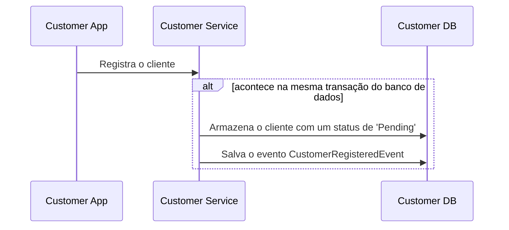
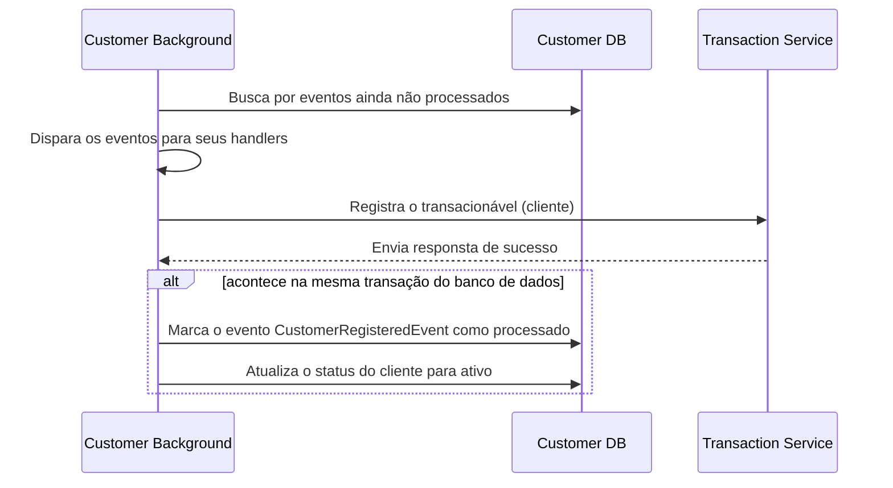

## Garantindo a consistênca em processos que não dependem apenas deles mesmos.

### **Registro de Cliente**

- Quando um cliente/usuário é registrado ao serviço de `customers`, ele também deve ser registrado ao serviço de `transactions`, o que normalmente não pode ser garantido, caso aconteçao uma eventual falha no segundo serviço. Para garantir a consistência entre esses serviços, foi aplicado o seguinte padrão:


- O serviço gera um evento durante determinado processo (o registro de um cliente nesse exêmplo) e é interrompido, guardando seu estado atual.



- Um processo rodando em background busca por eventos ainda não processados, envia para o serviço de `transactions`, garante o registro do cliente lá, e em uma mesma transação do banco de dados, marca tanto o evento como processado, quanto ativa o cliente.

- Caso aconteça uma falha no envio do registro para o serviço de `transactions` o processo vai ser interrompido. Como o evento não foi marcado como terminado, nas próximas buscas por eventos não processados o evento vai ser retornado, até que possa ser concluido.

O mesmo processo, também conhecido como [Outbox Pattern](https://learn.microsoft.com/en-us/azure/architecture/best-practices/transactional-outbox-cosmos), foi aplicado no processo de envio de transações, garantindo o envio dos emails de confirmação.

## Lidando com serviços externos não disponíveis

Nossos processos muitas chamadas para processos dos quais eles dependem. Eventualmente, essa demanda pode acabar ficando maior do que esse serviço pode suportar, talvez alcance algum limite definido por esse serviço ou algum outro comportamento não esperado pode acontecer.

Um padrão comumente aplicado para resolver esse problema é aplicar um algorítimo de circuit breaker aos clients HTTPS que fazem essas requisições. Quando a requisição retorna com falha, um contador de erros vai ser incrementado e as requests entrarão em timeout.

O cliente que implementa o circuit breaker possui três tipos de estados. Quando aberto, todas as transações recebidas serão recusadas dando tempo para o serviço se recuperar. Quando esse timeout acabar, o cliente transacionará para o estado de meio-aberto, onde ele ignora o limite de erros, e se alguma falha ocorrer, o cliente voltará novamente para o estado de aberto. Quando nenhuma transação com falha acontecer no período de meio aberto, o cliente será fechado, onde todas as transações são aceitas, até que o numero de falhas alcance um determinado limite e ele é aberto.

Diagrama exêmplificando o processo:


Referência: https://martinfowler.com/bliki/CircuitBreaker.html


<!--
```mermaid
sequenceDiagram
Customer App->>Customer Service: Send money
Customer Service->>Transaction Service: Send transaction
Transaction Service->>Transaction Data Store: Lock for Update
Transaction Service->>Transaction Data Store: Check if sender has enough balance
Transaction Service->>External Authorization Service: Check if transaction is authorized
Transaction Service->>Transaction Data Store: Begin Transaction
Transaction Service->>Transaction Data Store: Insert Transaction
Transaction Service->>Transaction Data Store: Insert TransactionCreatedEvent
Transaction Service->>Transaction Data Store: Commit Transaction
Transaction Service->>Transaction Data Store: Release Lock
Transaction Service->>Customer Service: Return status
Customer Service->>Customer App: Return status
Customer Background Worker->>Transactions Data Store: Get outbox transactions
Transactions Data Store->>Customer Background Worker: Return transaction events
Customer Background Worker->>Customer Data Store: Begin transaction
Customer Background Worker->>Customer Data Store: Sync from transaction events
Customer Background Worker->>Customer Data Store: Commit transaction
Customer Background Worker->>Transactions Data Store: Mark events as processed
Customer Background Worker->>Customer Data Store: Return transactions which notifications have not been sent yet
Customer Background Worker->>Email Bus: Publish transactions
Customer Background Worker->>Customer Data Store: Mark transactions as their notifications were have been sent.
``` -->
