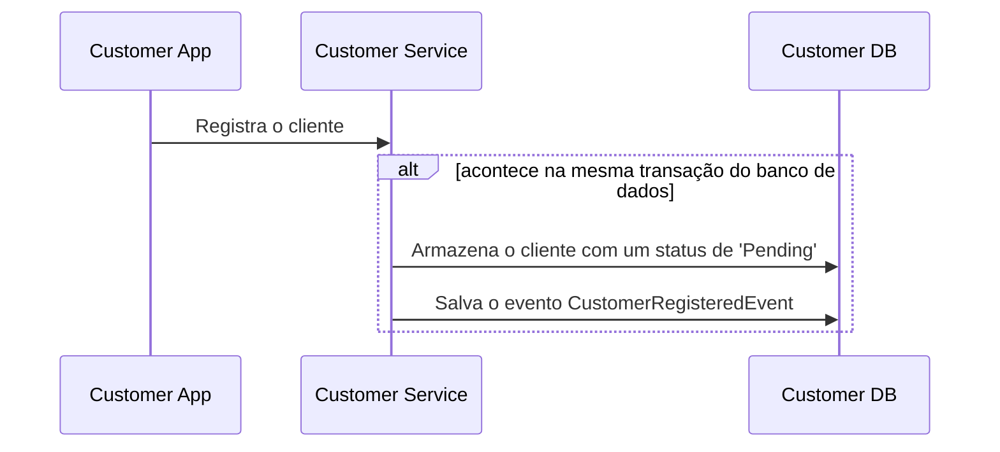
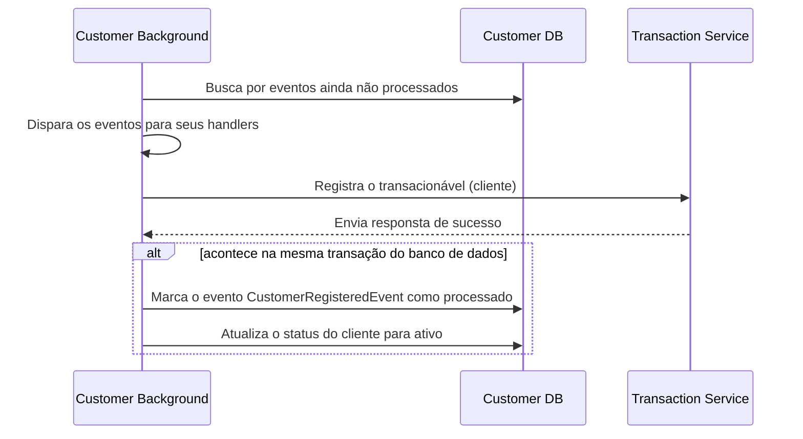
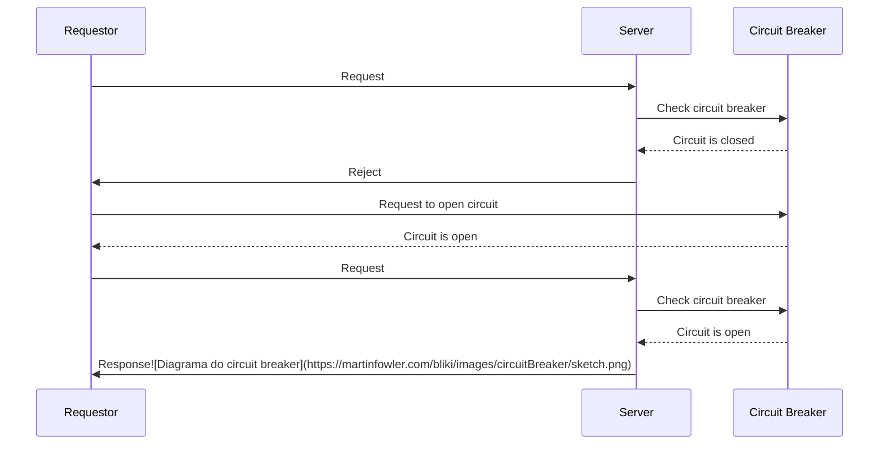

# Um Sistema Distribuido de Transações Monetárias

## Sobre o projeto

### Overview
---

Esse sistema permite o cadastro de usuários do tipo cliente e lojista. Ambos possuem uma carteira com dinheiro e podem realizar transações entre si. Uma notificação de confirmação é enviada para quem recebeu esse dinheiro quando a transação é aprovada com sucesso. Foi definido que lojistas não podem efetuar transações, apenas recebe-las.

O usuário final não tem nenhum contato com o serviço de transações, ele se comunica apenas com seu serviço, onde ele executa as ações necessárias entre o serviço do usuário e o de transações para realizar esse processo.

### Processo de registro de transações
---

Transações são criadas com um status de `PENDING`, e o saldo dos usuários referentes a essa transação não é atualziado de cara. A aprovação das transações criadas acontece utilizando um serviço externo, e o saldo dos usuários é finalmente atualizado. Utilizei essa estrutura imaginando que esse autenticador externo (que hoje em dia é apenas um mock), precisaria das informações concretas da transação.

Se eu não armazenasse a transação, à enviasse pro autenticador, e meu serviço caísse, o serviço externo teria autenticado uma transação que não existe, e precisaria ser feita novamente.

Eu poderia utilizar DB Transacitons para garantir essa consistência, mas já que na minha hipótese, esse serviço seria algo externo à minha aplicação e consequentemente as requisições seriam mais demoradas, eu preferi separar esse processo para não travar a transação e não manter a conexão aberta por muito tempo.

## Garantindo a consistênca em processos que não dependem apenas deles mesmos.

### **Registro de Cliente**

- Quando um cliente/usuário é registrado ao serviço de `customers`, ele também deve ser registrado ao serviço de `transactions`, o que normalmente não pode ser garantido, caso aconteçao uma eventual falha no segundo serviço. Para garantir a consistência entre esses serviços, foi aplicado o seguinte padrão:


- O serviço gera um evento durante determinado processo (o registro de um cliente nesse exêmplo) e é interrompido, guardando seu estado atual.



- Um processo rodando em background busca por eventos ainda não processados, envia para o serviço de `transactions`, garante o registro do cliente lá, e em uma mesma transação do banco de dados, marca tanto o evento como processado, quanto ativa o cliente.

- Caso aconteça uma falha no envio do registro para o serviço de `transactions` o processo vai ser interrompido. Como o evento não foi marcado como terminado, nas próximas buscas por eventos não processados o evento vai ser retornado, até que possa ser concluido.

O mesmo processo, também conhecido como [Outbox Pattern](https://learn.microsoft.com/en-us/azure/architecture/best-practices/transactional-outbox-cosmos), foi aplicado no processo de envio de transações, garantindo o envio dos emails de confirmação.

## Lidando com serviços externos não disponíveis

Nossos processos muitas chamadas para processos dos quais eles dependem. Eventualmente, essa demanda pode acabar ficando maior do que esse serviço pode suportar, talvez alcance algum limite definido por esse serviço ou algum outro comportamento não esperado pode acontecer.

Um padrão comumente aplicado para resolver esse problema é aplicar um algorítimo de circuit breaker aos clients HTTPS que fazem essas requisições. Quando a requisição retorna com falha, um contador de erros vai ser incrementado e as requests entrarão em timeout.

O cliente que implementa o circuit breaker possui três tipos de estados. Quando aberto, todas as transações recebidas serão recusadas dando tempo para o serviço se recuperar. Quando esse timeout acabar, o cliente transacionará para o estado de meio-aberto, onde ele ignora o limite de erros, e se alguma falha ocorrer, o cliente voltará novamente para o estado de aberto. Quando nenhuma transação com falha acontecer no período de meio aberto, o cliente será fechado, onde todas as transações são aceitas, até que o numero de falhas alcance um determinado limite e ele é aberto.

Diagrama exêmplificando o processo:



Esse algorítimo foi aplicado à classe `BaseClient`, extendida por todos os clientes HTTP implementados no sistema. O estado do circuito é salvo em cache. Caso aconteça alguma falha eventual no Redis, a implementação é desativada, e todas as requests se comportarão normalmente.

Referência: https://martinfowler.com/bliki/CircuitBreaker.html

## Como rodar o sistema

Requisitos básicos:
- PHP 8.1
- Docker
- Git

1. Clone o projeto
```sh
git clone git@github.com:henri1i/money-transaction-system.git && cd money-transaction-system
```

2. Execute os containers
```sh
docker-compose up -d
```

3. Copie os .envs em todos os serviços
```sh
cp customer-service/.env.example customer-service/.env &&  cp transaction-service/.env.example transaction-service/.env
```
PS: A variável `TRANSACTIONS_SERVICE_URL` precisa conter a url na qual esse servidor vai escutar por requisições.

4. Rode os seguintes comandos em todos os serviços:
```sh
cd transacion-service &&
composer install
```
```sh
php artisan migrate
```
```
php arisan serve --port 8000
```

5. Pronto! O sistema já está pronto para receber requisições.

## Endpoints

Autenticação de clientes:

POST `http://customers-base-url/customer/auth/register`

Payload:
```json
{
    "full_name": "henri",
    "cpf": "valid-cpf",
    "email": "contact@henri1i.me",
    "password": "strong_password",
    "password_confirmation": "strong_password"
}
```

POST `https://customers-base-url/customer/auth/login`

Payload:

```json
{
    "provider_id": "98517a01-940f-41e3-88ec-338e2dd758a9",
    "provider": "customers"
}
```

Transações do cliente:

GET: `https://customers-base-url/customer/wallet/balance`
Header: `Authorization: Bearer`

Response:
```json
{
    "balance": 0
}
```

GET: `https://customers-base-url/customer/wallet/transaction`
Header: `Authorization: Bearer`

Response:
```json
{
    "transactions": [
        {
            "id": "transaction-uuid",
            "sender_id": "sender-uuid",
            "receiver_id": "receiver-uuid",
            "amount": 5000,
        }
    ],
    "per_page": 15,
    "page": 1
}
```

POST: `https://customers-base-url/customer/wallet/transaction`
Header: `Authorization: Bearer`

Payload:
```json
{
    "//tipos válidos de receivers": "customer ou shopkeeper",
    "receiver_type": "customer",
    "receiver_id": "receiver-uuid",
    "amount": 5000
}
```
