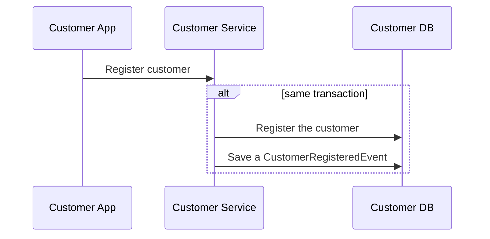

# Linha do tempo dos principais eventos entre os sistemas

## - Registro de Cliente

- Quando um cliente/usuário é registrado ao serviço de `customers`, ele também deve ser registrado ao serviço de `transactions`. A consistência do processo é garantida por estarmos utilizando o [padrão outbox](https://learn.microsoft.com/en-us/azure/architecture/best-practices/transactional-outbox-cosmos), como demonstrado no diagrama abaixo.

